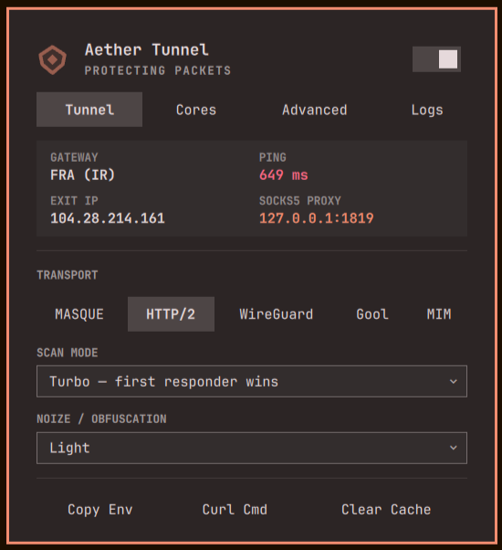

# Aether Plugin for Omarchy Shell

An [Omarchy](https://omarchy.org/) status bar and quick control plugin for [Aether](https://github.com/CluvexStudio/Aether) — a Rust userspace WARP core built for heavily restricted and censored networks.



---

## Features

- **Status Bar Indicator:**
  - Real-time tunnel state (Connected, Connecting, Disconnected, or Error).
  - Left-click to toggle the popup control panel.
  - Right-click for instant connect / disconnect toggle.
  - Middle-click to force refresh connection metrics.
- **Connection Details & Live Metrics:**
  - Cloudflare Colo gateway (e.g. `FRA`, `AMS`) and exit country.
  - Live round-trip latency (ping ms).
  - Assigned WARP Exit IP address.
  - Local SOCKS5 proxy port (`127.0.0.1:1819`).
- **Complete Protocol & Scan Presets:**
  - Protocols: **MASQUE** (HTTP/3 QUIC), **MASQUE HTTP/2**, **WireGuard**, **Gool** (WARP-in-WARP), **MIM** (MASQUE-in-MASQUE), and **Tor**.
  - Scan Profiles: **Balanced**, **Turbo**, **Thorough**, and **Ironclad** (data-plane validated).
  - Obfuscation / Noize: **Firewall**, **GFW**, **Aggressive**, and **Off**.
- **System Proxy Integration:**
  - Toggle GNOME / desktop system proxy with a single click to route all browser and system apps through Aether without per-app configuration.
- **Quick Copy Actions:**
  - One-click copy for SOCKS5 URL (`socks5h://127.0.0.1:1819`).
  - One-click copy for shell environment variables (`export all_proxy=...`).
  - One-click copy for `curl` connectivity test command.
- **Self-Contained & Automated Setup:**
  - If the `aether` binary is not found on your system, the plugin provides a one-click installer that automatically downloads the latest official release for your architecture (`x86_64`, `arm64`, `armv7`).

---

## Installation

### Method 1: Using the Omarchy CLI (Recommended)

Once published to GitHub:

```bash
omarchy plugin add https://github.com/YOUR_USERNAME/omarchy-aether.git --enable
```

### Method 2: Manual Clone

Clone into your Omarchy plugins directory:

```bash
git clone https://github.com/YOUR_USERNAME/omarchy-aether.git ~/.config/omarchy/plugins/cluvex.aether
omarchy plugin enable cluvex.aether
```

---

## Recommended: Permission Setup for `--mark 0xff`

If your system uses routing rules that require the `--mark 0xff` socket firewall mark (such as with tun2socks or transparent bypasses), give the binary `CAP_NET_ADMIN` capability so it can set socket marks without requiring `sudo` or password prompts:

```bash
sudo setcap cap_net_admin+ep /path/to/aether
```

For the built-in downloaded binary:

```bash
sudo setcap cap_net_admin+ep ~/.local/share/omarchy-aether/bin/aether
```

### Optional Systemd User Service

You can also run Aether as a systemd user service:

```bash
mkdir -p ~/.config/systemd/user/
cp ~/.config/omarchy/plugins/cluvex.aether/systemd/aether.service ~/.config/systemd/user/
systemctl --user daemon-reload
systemctl --user enable --now aether
```

---

## IPC Commands

You can control Aether from scripts or Hyprland keybindings via Omarchy IPC:

```bash
# Toggle popup panel
omarchy-shell shell summon cluvex.aether

# Quick connect / disconnect
omarchy-shell cluvex.aether toggle

# Toggle desktop system proxy
omarchy-shell cluvex.aether toggleProxy

# Force status refresh
omarchy-shell cluvex.aether refresh
```

---

## License

MIT License. See [LICENSE](LICENSE) for details.
